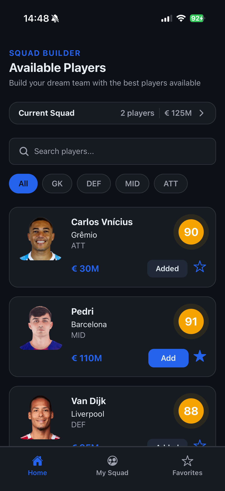
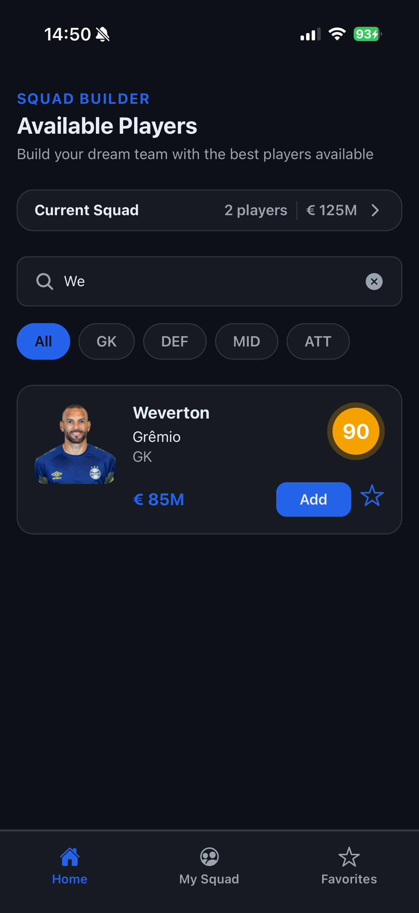
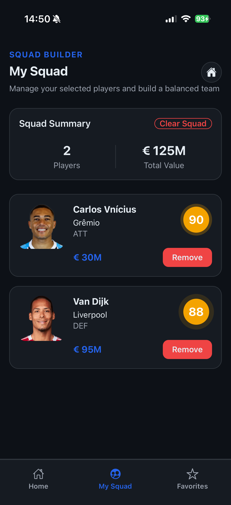
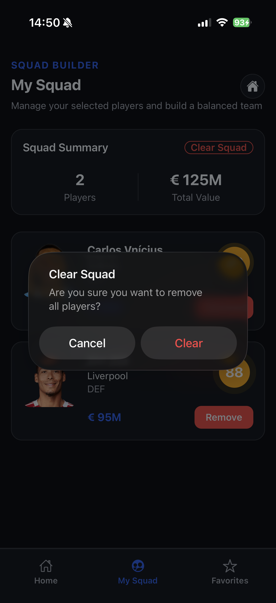
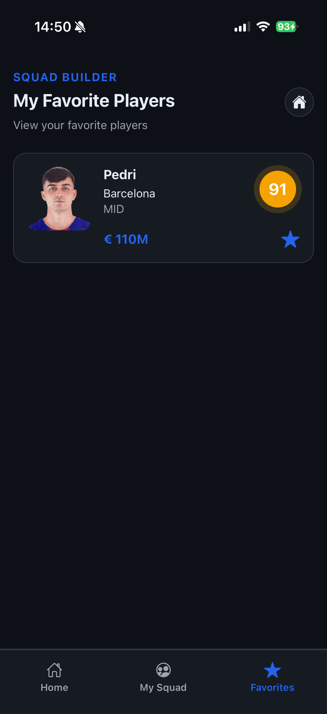
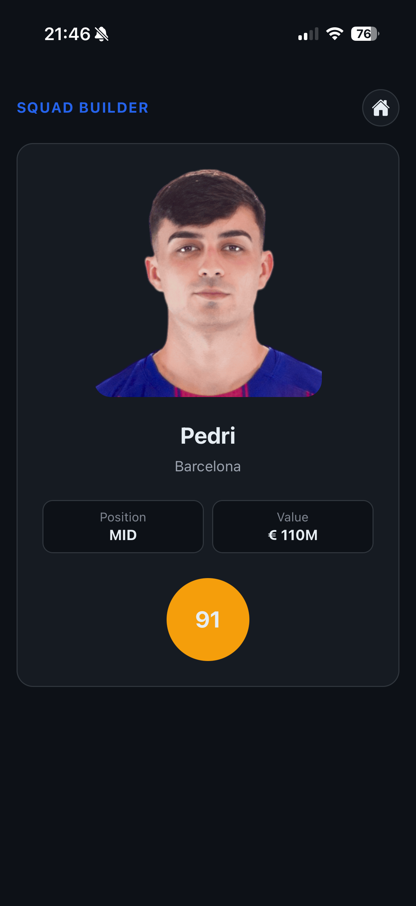

# ⚽ Squad Builder

A mobile app built with **React Native + Expo** that allows users to build their own football squad in a simple and interactive way.

---

## 📸 Screenshots

### 🏠 Home

<p align="center">
  
  
</p>

### 📋 Squad

<p align="center">
  
  
</p>

### ⭐ Favorites

<p align="center">
  
</p>

### 👤 Player Details

<p align="center">
  
</p>

---

## 📱 About the Project

The app simulates a football team management experience where users can browse players, build their own squad, and manage total squad value in a simple and interactive way.

The focus of this project is to apply real-world mobile development practices, including scalable architecture, state management, and reusable components.

---

## 🚀 Features

- Browse available players
- Search players by name
- Filter players by position
- Add players to your squad
- Remove players from your squad
- Clear search input
- View squad summary (total players & total value)
- Player details screen
- Empty state handling (squad & search)
- Image fallback handling

---

## 🛠️ Tech Stack

- **React Native**
- **Expo**
- **TypeScript**
- **Expo Router**
- **Zustand** (global state management with persistence)

---

## 📂 Project Structure

```
app/
  (tabs)/
    index.tsx
    squad.tsx
    favorites.tsx
  player/
    [id].tsx

src/
  components/
  data/
  hooks/
  stores/
  theme/
  types/
```

---

## ⚙️ Getting Started

### 1. Clone the repository

```bash
git clone https://github.com/lleonardooalves/squad-builder.git
```

### 2. Navigate to the project

```bash
cd squad-builder
```

### 3. Install dependencies

```bash
npm install
```

### 4. Run the project

```bash
npx expo start
```

---

## 📲 Running on Device

- Expo Go (iOS or Android)
- iOS Simulator
- Android Emulator

---

## ✨ Highlights

- Clean architecture inspired by MVVM (View + Hooks + Global State)
- Reusable component structure (PlayerCard, SummaryCard, Lists, Headers)
- Global state management with Zustand + persistence (AsyncStorage)
- Scalable folder structure using Expo Router
- Focus on UX details (empty states, search interactions, smooth navigation)

---

## 📈 Future Improvements

- Business rules for squad composition
- Advanced filtering (by rating, price, etc.)
- Animations and visual feedback improvements
- Backend integration

---

## 👨‍💻 Author

Developed by Leonardo Alves
